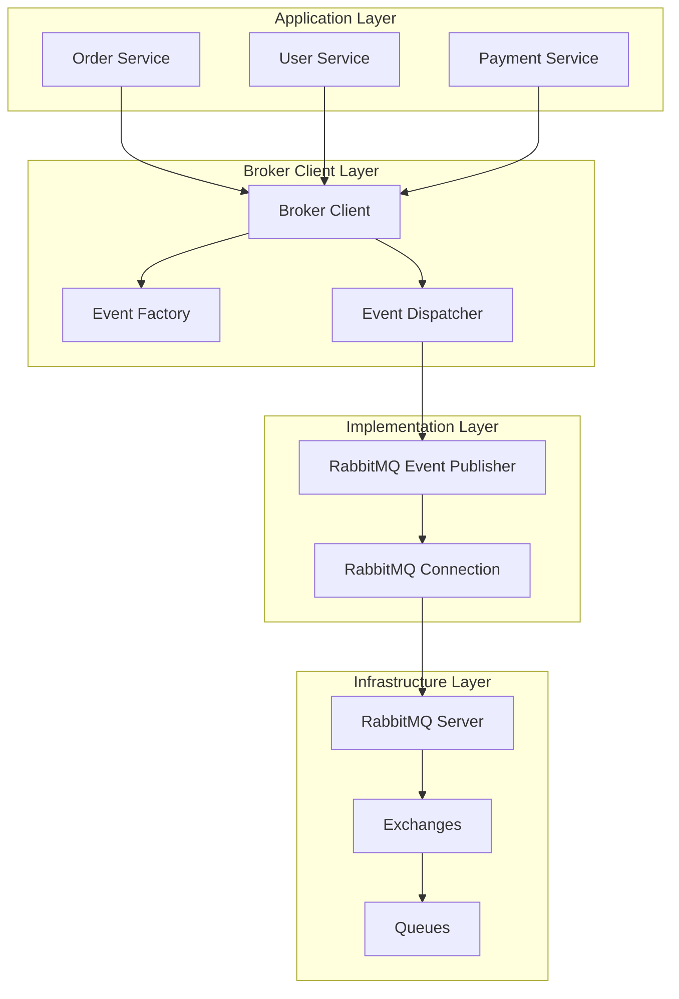

# Message Broker Architecture

## Overview

This document describes the refactored message broker architecture for the microservices system, designed following SOLID principles and Node.js best practices. The architecture provides a reusable, scalable, and maintainable event-driven communication system.

## Table of Contents

1. [Architecture Overview](#architecture-overview)
2. [Design Principles](#design-principles)
3. [Component Structure](#component-structure)
4. [How-to Guides](#how-to-guides)
5. [API Reference](#api-reference)
6. [Technical Explanation](#technical-explanation)

---

## Architecture Overview

The message broker architecture follows a layered, component-based design that separates concerns and promotes reusability across microservices.

### High-Level Architecture



---

## Design Principles

The architecture adheres to the SOLID principles:

### 🎯 Single Responsibility Principle (SRP)
- **RabbitMQConnection**: Only manages connection lifecycle
- **RabbitMQEventPublisher**: Only publishes events
- **EventFactory**: Only creates domain events
- **EventDispatcher**: Only dispatches events to appropriate channels

### 🔓 Open/Closed Principle (OCP)
- Easy to extend with new event types without modifying existing code
- Simple to add new broker implementations (Kafka, Redis, etc.)

### 🔄 Liskov Substitution Principle (LSP)
- All implementations can be substituted through their interfaces
- Mock implementations for testing follow the same contracts

### 🧩 Interface Segregation Principle (ISP)
- Focused interfaces: `IMessageBrokerConnection`, `IEventPublisher`, `IEventConsumer`
- Clients depend only on methods they use

### 🔗 Dependency Inversion Principle (DIP)
- High-level modules depend on abstractions, not concretions
- Dependency injection throughout the architecture

---

## Component Structure

```
apps/order-service/src/broker/
├── interfaces/                    # 🔌 Abstractions
│   ├── message-broker.interface.ts
│   └── events.interface.ts
├── implementations/               # 🛠️ Concrete implementations
│   ├── rabbitmq-connection.ts
│   └── rabbitmq-event-publisher.ts
├── events/                       # 🎯 Event handling
│   ├── event-factory.ts
│   └── event-dispatcher.ts
├── config/                       # ⚙️ Configuration
│   └── broker.config.ts
├── broker-client.ts              # 🎭 Facade
└── index.ts                      # 📦 Public exports
```

### Component Responsibilities

| Component | Responsibility | Pattern |
|-----------|---------------|---------|
| `BrokerClient` | Orchestrates all messaging components | Facade |
| `RabbitMQConnection` | Manages connection lifecycle | Adapter |
| `RabbitMQEventPublisher` | Publishes events to broker | Strategy |
| `EventFactory` | Creates domain events | Factory |
| `EventDispatcher` | Routes events to appropriate channels | Command |
| Configuration | Centralized settings management | Configuration Object |

---

## How-to Guides

### Getting Started

#### 1. Initialize the Broker Client

```typescript
import { initializeBrokerClient } from './broker'

// On application startup
await initializeBrokerClient()
```

#### 2. Publish an Event

```typescript
import { getBrokerClient } from './broker'

const brokerClient = getBrokerClient()

// Simple convenience method
await brokerClient.publishOrderCreated({
  orderId: 'order-123',
  userId: 'user-456',
  subscriptionPlan: 'premium',
  amount: '19.99',
  currency: 'USD',
  status: 'pending'
})

// Or use the event factory and dispatcher directly
const eventFactory = brokerClient.getEventFactory()
const eventDispatcher = brokerClient.getEventDispatcher()

const event = eventFactory.createOrderCreatedEvent(orderData)
await eventDispatcher.dispatch(event)
```

#### 3. Graceful Shutdown

```typescript
import { shutdownBrokerClient } from './broker'

// On application shutdown
process.on('SIGTERM', async () => {
  await shutdownBrokerClient()
  process.exit(0)
})
```

### Advanced Usage

#### Custom Configuration

```typescript
import { BrokerClient } from './broker'

const customConfig = {
  url: 'amqp://custom-rabbitmq:5672',
  exchanges: [
    {
      name: 'custom-events',
      type: 'topic',
      options: { durable: true }
    }
  ],
  queues: [
    {
      name: 'custom-queue',
      options: { durable: true },
      bindings: [
        {
          exchange: 'custom-events',
          routingKey: 'custom.*'
        }
      ]
    }
  ]
}

const brokerClient = new BrokerClient(customConfig)
await brokerClient.connect()
```

#### Adding New Event Types

1. **Extend the event interface**:

```typescript
// In events.interface.ts
export interface UserCreatedEvent extends BaseEvent {
  eventType: 'user.created'
  data: {
    userId: string
    email: string
    plan: string
  }
}
```

2. **Update the event factory**:

```typescript
// In event-factory.ts
createUserCreatedEvent(userData: {
  userId: string
  email: string
  plan: string
}): UserCreatedEvent {
  return {
    eventId: randomUUID(),
    eventType: 'user.created',
    timestamp: new Date().toISOString(),
    version: this.version,
    data: userData
  }
}
```

3. **Update the event dispatcher routing**:

```typescript
// In event-dispatcher.ts
private getEventRouting(event: BaseEvent): { exchange: string, routingKey: string } {
  switch (event.eventType) {
    case 'order.created':
      return { exchange: 'order-events', routingKey: 'order.created' }
    case 'user.created':
      return { exchange: 'user-events', routingKey: 'user.created' }
    default:
      throw new Error(`Unknown event type: ${event.eventType}`)
  }
}
```

---

## API Reference

### BrokerClient

Main facade for interacting with the message broker system.

#### Methods

##### `connect(): Promise<void>`
Initializes the broker connection and infrastructure.

```typescript
const brokerClient = getBrokerClient()
await brokerClient.connect()
```

##### `disconnect(): Promise<void>`
Closes the broker connection gracefully.

```typescript
await brokerClient.disconnect()
```

##### `isConnected(): boolean`
Checks if the broker is currently connected.

```typescript
if (brokerClient.isConnected()) {
  // Safe to publish events
}
```

##### `publishOrderCreated(orderData): Promise<void>`
Convenience method to publish order creation events.

**Parameters:**
- `orderData.orderId: string` - Unique order identifier
- `orderData.userId: string` - User identifier
- `orderData.subscriptionPlan: string` - Subscription plan name
- `orderData.amount: string` - Order amount
- `orderData.currency: string` - Currency code
- `orderData.status: string` - Order status

```typescript
await brokerClient.publishOrderCreated({
  orderId: 'ord_123',
  userId: 'usr_456',
  subscriptionPlan: 'premium',
  amount: '29.99',
  currency: 'USD',
  status: 'pending'
})
```

### Interfaces

#### `IEventPublisher`

```typescript
interface IEventPublisher {
  publish<T extends Record<string, any>>(
    exchange: string,
    routingKey: string,
    event: T,
    options?: PublishOptions
  ): Promise<void>
}
```

#### `IEventFactory`

```typescript
interface IEventFactory {
  createOrderCreatedEvent(orderData: OrderData): OrderCreatedEvent
}
```

#### `IEventDispatcher`

```typescript
interface IEventDispatcher {
  dispatch<T extends BaseEvent>(event: T): Promise<void>
}
```

### Configuration

#### `BrokerConfig`

```typescript
interface BrokerConfig {
  url: string
  exchanges: ExchangeConfig[]
  queues: QueueConfig[]
  connectionOptions?: ConnectionOptions
}
```

#### Default Configuration

```typescript
const defaultBrokerConfig: BrokerConfig = {
  url: process.env.RABBITMQ_URL || 'amqp://localhost:5672',
  exchanges: [
    {
      name: 'order-events',
      type: 'direct',
      options: { durable: true, autoDelete: false }
    }
  ],
  queues: [
    {
      name: 'order-created',
      options: { durable: true, exclusive: false, autoDelete: false },
      bindings: [
        { exchange: 'order-events', routingKey: 'order.created' }
      ]
    }
  ],
  connectionOptions: {
    heartbeat: 60,
    connectionTimeout: 30000
  }
}
```

---

## Technical Explanation

### Why This Architecture?

#### Event-Driven Architecture Benefits

1. **Loose Coupling**: Services communicate through events, not direct calls
2. **Scalability**: Easy to scale individual services independently
3. **Resilience**: System continues working even if some services are down
4. **Auditability**: All events are logged and trackable

#### SOLID Principles in Practice

The architecture demonstrates each SOLID principle:

**Single Responsibility**: Each class has one reason to change
- Connection management is separate from event publishing
- Event creation is separate from event dispatching

**Open/Closed**: Easy to extend without modification
- New event types can be added without changing existing code
- New broker implementations can be plugged in

**Liskov Substitution**: Implementations are interchangeable
- Mock implementations for testing
- Different broker providers (RabbitMQ, Kafka, Redis)

**Interface Segregation**: Focused, specific interfaces
- Publishers don't need to know about consumers
- Connection management is separate from publishing

**Dependency Inversion**: Depend on abstractions
- High-level `BrokerClient` doesn't depend on RabbitMQ specifics
- Easy to swap implementations

### Performance Considerations

#### Connection Management
- **Connection Pooling**: Single connection shared across the application
- **Channel Reuse**: Efficient channel management for publishing
- **Heartbeat Configuration**: Keeps connections alive efficiently

#### Event Publishing
- **Persistent Messages**: Events survive broker restarts
- **Routing Optimization**: Direct exchange for simple routing
- **Batching Support**: Can be extended for batch publishing

#### Memory Management
- **Graceful Shutdown**: Proper cleanup of resources
- **Error Handling**: Prevents memory leaks from failed operations

### Security Considerations

#### Authentication & Authorization
- Connection credentials managed via environment variables
- Support for TLS/SSL connections
- Queue and exchange permissions

#### Data Privacy
- Event payload encryption can be added at the publisher level
- Sensitive data should be referenced, not embedded in events
- Audit logging for compliance requirements

### Monitoring & Observability

#### Logging Strategy
```typescript
// Connection events
console.log('🔌 Connecting to RabbitMQ...')
console.log('✅ Connected to RabbitMQ')

// Infrastructure setup
console.log(`📡 Exchange '${exchange.name}' ready`)
console.log(`📬 Queue '${queue.name}' ready`)

// Event publishing
console.log(`📤 Published event to exchange '${exchange}' with routing key '${routingKey}'`)
console.log(`🚀 Dispatched event: ${event.eventType} (${event.eventId})`)
```

#### Metrics to Monitor
- **Connection Health**: Connection uptime, reconnection frequency
- **Event Throughput**: Events published per second
- **Queue Depth**: Backlog in queues
- **Error Rates**: Failed publications, connection errors

### Testing Strategy

#### Unit Testing
```typescript
// Mock implementations for testing
class MockEventPublisher implements IEventPublisher {
  publishedEvents: any[] = []
  
  async publish(exchange: string, routingKey: string, event: any) {
    this.publishedEvents.push({ exchange, routingKey, event })
  }
}
```

#### Integration Testing
- Test actual RabbitMQ connection
- Verify exchange and queue setup
- End-to-end event flow testing

#### Load Testing
- High-volume event publishing
- Connection stability under load
- Memory usage patterns

### Migration Guide

#### From Legacy Message Broker Service

1. **Replace imports**:
```typescript
// Old
import { messageBrokerService } from './services/message-broker.service'

// New
import { getBrokerClient } from './broker'
```

2. **Update connection handling**:
```typescript
// Old
await messageBrokerService.connect()
await messageBrokerService.disconnect()

// New
await initializeBrokerClient()
await shutdownBrokerClient()
```

3. **Update event publishing**:
```typescript
// Old
await messageBrokerService.publishOrderCreatedEvent(event)

// New
const brokerClient = getBrokerClient()
await brokerClient.publishOrderCreated(orderData)
```

### Future Enhancements

#### Planned Features
- **Consumer Support**: Subscribe to events from other services
- **Dead Letter Queues**: Handle failed message processing
- **Message Deduplication**: Prevent duplicate event processing
- **Schema Registry**: Validate event schemas
- **Multiple Broker Support**: Kafka, Redis Streams integration

#### Extensibility Points
- **Custom Event Types**: Easy to add new domain events
- **Custom Routing**: Flexible routing strategies
- **Middleware Support**: Pre/post publishing hooks
- **Serialization Options**: JSON, Avro, Protocol Buffers

---

## Conclusion

This message broker architecture provides a solid foundation for event-driven microservices communication. By following SOLID principles and Node.js best practices, it ensures maintainability, testability, and scalability while remaining simple to use and extend.

The architecture successfully decouples services, provides reliable event delivery, and maintains high performance through efficient connection and resource management.
