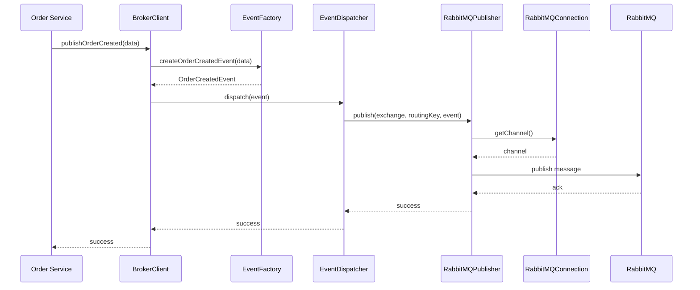
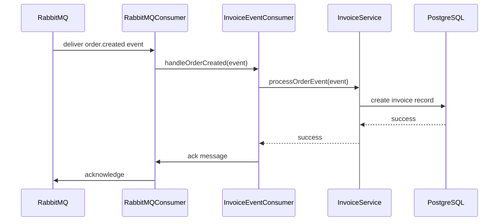
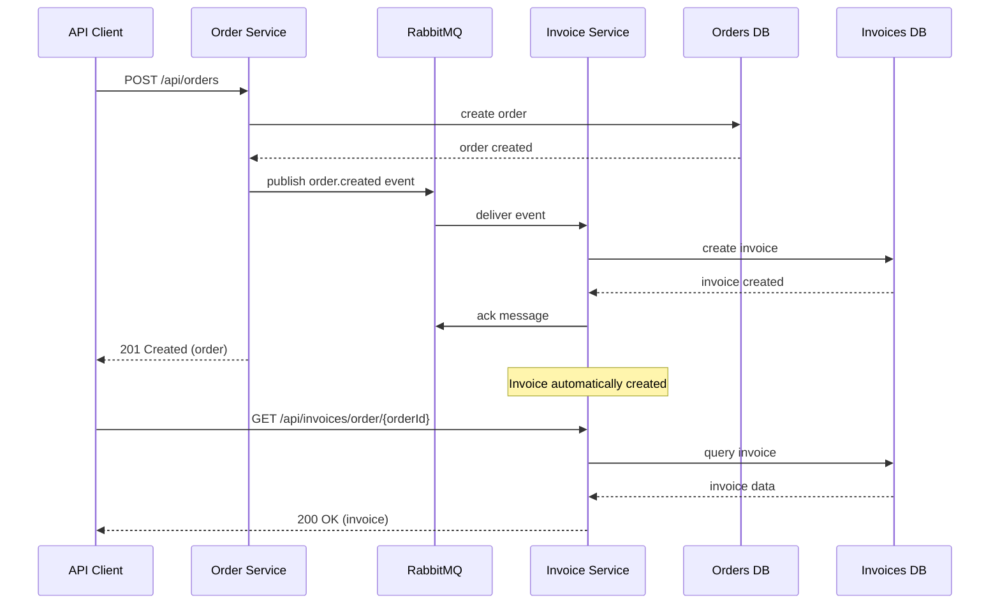

# Project Structure - Message Broker Architecture

## 📁 Complete Project Structure

```
microservices/
├── docs/                                    # 📚 Documentation
│   ├── architecture/                       # 🏗️ Architecture documentation
│   │   ├── README.md                       # 📖 Documentation hub (Diátaxis)
│   │   ├── MESSAGE_BROKER_ARCHITECTURE.md  # 💡 Technical explanation
│   │   ├── GETTING_STARTED_TUTORIAL.md     # 🎯 Learning tutorial
│   │   ├── QUICK_REFERENCE.md              # 🛠️ How-to guides & reference
│   │   └── PROJECT_STRUCTURE.md            # 📋 This file
│   ├── feature/                            # 🎯 Feature documentation
│   │   ├── orders/                         # 📋 Order management features
│   │   │   └── 01.CREATE_ORDER.md          # Order creation feature
│   │   └── invoices/                       # 🧾 Invoice processing features
│   │       ├── README.md                   # Invoice service overview
│   │       ├── TECHNICAL_SPECIFICATION.md  # Technical specs
│   │       └── 01.CREATE_INVOICE.md        # Automatic invoice creation
│   └── CHALLENGE.md                        # Original challenge description
│
├── apps/                                   # 🚀 Microservices & Shared Packages
│   ├── shared-broker/                     # 🎭 Shared Message Broker Package
│   │   ├── src/
│   │   │   ├── interfaces/                # 🔌 Abstractions
│   │   │   │   ├── message-broker.interface.ts
│   │   │   │   └── events.interface.ts
│   │   │   ├── implementations/           # 🛠️ Concrete implementations
│   │   │   │   ├── rabbitmq-connection.ts
│   │   │   │   ├── rabbitmq-event-publisher.ts
│   │   │   │   └── rabbitmq-event-consumer.ts
│   │   │   ├── events/                   # 🎯 Event handling
│   │   │   │   ├── event-factory.ts
│   │   │   │   └── event-dispatcher.ts
│   │   │   ├── config/                   # ⚙️ Configuration
│   │   │   │   └── broker.config.ts
│   │   │   ├── broker-client.ts          # 🎭 Main facade (Producer + Consumer)
│   │   │   └── index.ts                  # 📦 Public exports
│   │   ├── dist/                         # 📦 Built package
│   │   ├── package.json                  # 📦 Package definition
│   │   ├── tsconfig.json                 # ⚙️ TypeScript config
│   │   └── README.md                     # 📖 Package documentation
│   │
│   ├── order-service/                     # 🛍️ Order management service (Event Producer)
│   │   ├── src/
│   │   │   ├── db/                       # 🗃️ Database layer
│   │   │   │   ├── connection.ts
│   │   │   │   ├── migrate.ts
│   │   │   │   └── schema.ts
│   │   │   ├── routes/                   # 🛣️ API routes
│   │   │   │   ├── orders.ts
│   │   │   │   └── health.ts
│   │   │   ├── services/                 # 🔧 Business logic
│   │   │   │   └── order.service.ts
│   │   │   ├── types/                    # 📝 Type definitions
│   │   │   │   └── order.ts
│   │   │   └── index.ts                  # 🚪 Application entry point
│   │   ├── drizzle/                      # 📊 Database migrations
│   │   ├── package.json                  # 📦 Dependencies (includes @streamflix/shared-broker)
│   │   ├── tsconfig.json                 # ⚙️ TypeScript config
│   │   ├── drizzle.config.ts            # 🗃️ Drizzle ORM config
│   │   ├── Dockerfile                    # 🐳 Container definition (workspace-aware)
│   │   └── .env.example                  # 🔐 Environment variables
│   │
│   └── invoice-service/                   # 🧾 Invoice processing service (Event Consumer)
│       ├── src/
│       │   ├── db/                       # 🗃️ Database layer (shared PostgreSQL instance)
│       │   │   ├── connection.ts
│       │   │   ├── migrate.ts
│       │   │   └── schema.ts
│       │   ├── routes/                   # 🛣️ API routes
│       │   │   ├── invoices.ts
│       │   │   └── health.ts
│       │   ├── services/                 # 🔧 Business logic
│       │   │   ├── invoice.service.ts
│       │   │   └── invoice-event-consumer.ts
│       │   ├── types/                    # 📝 Type definitions
│       │   │   └── invoice.ts
│       │   └── index.ts                  # 🚪 Application entry point
│       ├── drizzle/                      # 📊 Database migrations
│       ├── package.json                  # 📦 Dependencies (includes @streamflix/shared-broker)
│       ├── tsconfig.json                 # ⚙️ TypeScript config
│       ├── drizzle.config.ts            # 🗃️ Drizzle ORM config
│       ├── Dockerfile                    # 🐳 Container definition (workspace-aware)
│       └── .env.example                  # 🔐 Environment variables
│
├── test/                                 # 🧪 Testing suite
│   ├── http/                            # 🌐 HTTP API tests
│   │   ├── order.http                   # Order service test scenarios
│   │   └── invoice.http                 # Invoice service test scenarios
│   └── README.md                        # Testing guide and procedures
│
├── scripts/                              # 🔧 Development tools
│   ├── create-service.js                # Service generator
│   └── dev-all.sh                       # Start all services
│
├── docker-compose.yml                    # 🐳 Infrastructure setup (RabbitMQ + PostgreSQL instances)
├── pnpm-workspace.yaml                  # 📦 Monorepo configuration
├── tsconfig.base.json                   # ⚙️ Base TypeScript config
└── README.md                            # 📖 Project overview
```

## 🎯 Architecture Layers

### 📱 Application Layer
```
apps/order-service/src/
├── index.ts              # Entry point, server setup
├── routes/               # HTTP API endpoints
└── services/             # Business logic
```

### 🎭 Broker Client Layer (Facade)
```
apps/order-service/src/broker/
├── broker-client.ts      # Main facade - single entry point
├── index.ts              # Public exports
```

### 🎯 Domain Layer
```
apps/order-service/src/broker/events/
├── event-factory.ts      # Creates domain events
└── event-dispatcher.ts   # Routes events to channels
```

### 🔌 Interface Layer (Abstractions)
```
apps/order-service/src/broker/interfaces/
├── message-broker.interface.ts  # Connection & Publisher contracts
└── events.interface.ts          # Event & Factory contracts
```

### 🛠️ Implementation Layer (Concrete)
```
apps/order-service/src/broker/implementations/
├── rabbitmq-connection.ts       # RabbitMQ connection manager
└── rabbitmq-event-publisher.ts  # RabbitMQ event publisher
```

### ⚙️ Configuration Layer
```
apps/order-service/src/broker/config/
└── broker.config.ts      # Centralized configuration
```

## 📚 Documentation Structure (Diátaxis Framework)

### 🎯 Tutorial (Learning-oriented)
**"I want to learn how to use this"**
- `GETTING_STARTED_TUTORIAL.md` - Step-by-step implementation guide

### 🛠️ How-to Guides (Problem-oriented)  
**"I want to solve a specific problem"**
- `QUICK_REFERENCE.md` - Common tasks and troubleshooting

### 📚 Reference (Information-oriented)
**"I need to look up specific information"**
- API documentation in `MESSAGE_BROKER_ARCHITECTURE.md`
- Configuration options in `QUICK_REFERENCE.md`

### 💡 Explanation (Understanding-oriented)
**"I want to understand the concepts and design decisions"**
- `MESSAGE_BROKER_ARCHITECTURE.md` - Complete architectural overview
- Design principles and technical explanations

## 🔄 Data Flow

### Event Publishing Flow (Order Service)


### Event Consumption Flow (Invoice Service)


### Complete End-to-End Flow


## 🎨 Design Patterns Used

| Pattern | Implementation | Purpose |
|---------|---------------|---------|
| **Facade** | `BrokerClient` | Simplified interface to complex subsystem |
| **Factory** | `EventFactory` | Creates objects without specifying exact classes |
| **Strategy** | `RabbitMQEventPublisher` | Encapsulates algorithm (publishing strategy) |
| **Adapter** | `RabbitMQConnection` | Adapts RabbitMQ client to our interface |
| **Command** | `EventDispatcher` | Encapsulates requests as objects |
| **Singleton** | `getBrokerClient()` | Single instance across application |

## 🏗️ SOLID Principles Implementation

### 🎯 Single Responsibility Principle (SRP)
- **RabbitMQConnection**: Only manages connections
- **RabbitMQEventPublisher**: Only publishes events  
- **EventFactory**: Only creates events
- **EventDispatcher**: Only routes events

### 🔓 Open/Closed Principle (OCP)
- Easy to add new event types without modifying existing code
- New broker implementations can be added without changes

### 🔄 Liskov Substitution Principle (LSP)
- All implementations can be substituted through interfaces
- Mock implementations work seamlessly in tests

### 🧩 Interface Segregation Principle (ISP)
- Focused interfaces: `IEventPublisher`, `IEventFactory`, etc.
- Clients depend only on methods they use

### 🔗 Dependency Inversion Principle (DIP)
- High-level modules depend on abstractions
- Dependency injection throughout the architecture

## 🔧 Key Components Responsibilities

### 🎭 BrokerClient (Facade)
```typescript
// Single entry point for all broker operations
const brokerClient = getBrokerClient()
await brokerClient.publishOrderCreated(orderData)
```

**Responsibilities:**
- Orchestrates all messaging components
- Provides simple API for applications
- Manages component lifecycle

### 🏭 EventFactory (Factory Pattern)
```typescript
const event = eventFactory.createOrderCreatedEvent(orderData)
```

**Responsibilities:**
- Creates standardized domain events
- Ensures consistent event structure
- Handles event metadata (ID, timestamp, version)

### 📨 EventDispatcher (Command Pattern)
```typescript
await eventDispatcher.dispatch(event)
```

**Responsibilities:**
- Routes events to appropriate exchanges
- Maps event types to routing configurations
- Handles publishing coordination

### 🔌 RabbitMQConnection (Adapter Pattern)
```typescript
await connection.connect()
const channel = connection.getChannel()
```

**Responsibilities:**
- Manages RabbitMQ connection lifecycle
- Sets up exchanges and queues
- Handles connection errors and recovery

### 📤 RabbitMQEventPublisher (Strategy Pattern)
```typescript
await publisher.publish(exchange, routingKey, event)
```

**Responsibilities:**
- Publishes events to RabbitMQ
- Handles message serialization
- Manages publishing options and headers

## 🚀 Getting Started

1. **For New Services**: Follow the [Getting Started Tutorial](./GETTING_STARTED_TUTORIAL.md)
2. **For Quick Tasks**: Use the [Quick Reference](./QUICK_REFERENCE.md)  
3. **For Deep Understanding**: Read the [Architecture Overview](./MESSAGE_BROKER_ARCHITECTURE.md)

## 📈 Scalability Considerations

### Horizontal Scaling
- Multiple service instances can share the same broker
- Connection pooling handles multiple consumers
- Queue-based load distribution

### Performance Optimization
- Persistent connections reduce overhead
- Channel reuse for publishing efficiency
- Configurable message persistence

### Resource Management
- Graceful shutdown prevents message loss
- Connection heartbeat keeps links alive
- Memory-efficient event serialization

## 🔮 Future Extensions

The architecture is designed for easy extension:

### 🎯 Event System Extensions
- **New Event Types**: Add to factory and dispatcher (payment.processed, user.registered, etc.)
- **Schema Registry**: Validate event schemas with Avro or JSON Schema
- **Event Versioning**: Handle backward/forward compatibility
- **Event Sourcing**: Complete audit trail of all events

### 🔌 Broker Extensions  
- **New Brokers**: Implement interfaces for Kafka, Redis Streams, AWS SQS
- **Dead Letter Queues**: Handle failed message processing with retry policies
- **Priority Queues**: Handle urgent vs normal events differently
- **Message Deduplication**: Prevent duplicate event processing

### 🚀 Service Extensions
- **New Microservices**: Payment Service, Notification Service, Analytics Service
- **API Gateway**: Centralized routing and authentication
- **Service Discovery**: Dynamic service registration and discovery
- **Load Balancing**: Distribute load across service instances

### 📊 Observability Extensions
- **Distributed Tracing**: Track events across service boundaries
- **Metrics Collection**: Prometheus/Grafana for monitoring
- **Log Aggregation**: Centralized logging with ELK stack
- **Health Dashboards**: Real-time service status monitoring

### 🔒 Security & Reliability Extensions
- **Event Encryption**: Secure sensitive event data
- **Circuit Breakers**: Prevent cascade failures
- **Rate Limiting**: Protect services from overload
- **Backup & Recovery**: Event store backup strategies

This structure provides a solid foundation for scalable, maintainable event-driven microservices communication! 🎉
