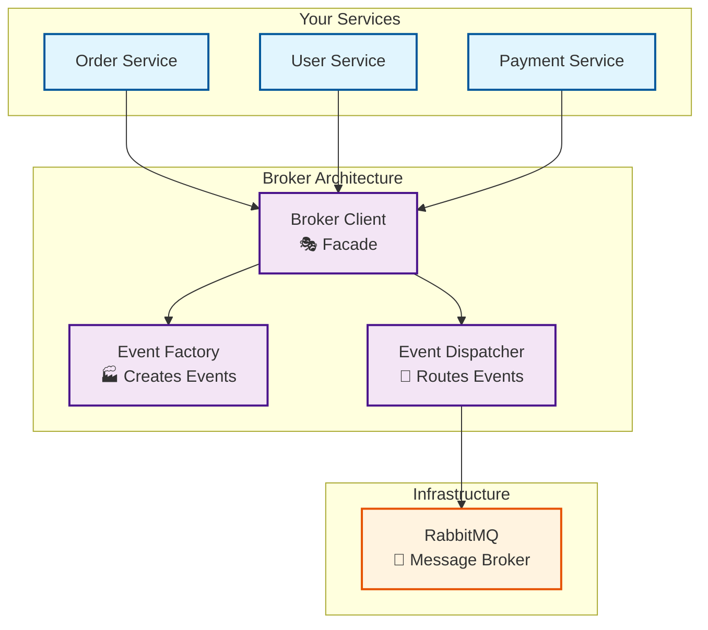

# Message Broker Architecture Documentation

Welcome to the comprehensive documentation for our microservices message broker architecture. This documentation follows the [Diátaxis framework](https://diataxis.fr/) to provide you with the right information at the right time.

## 📖 Documentation Structure

Our documentation is organized into four types to serve different needs:

### 🎯 **Tutorial** - Learning-oriented
**"I want to learn how to use this"**

- [**Getting Started Tutorial**](./GETTING_STARTED_TUTORIAL.md) - Step-by-step guide to implement the message broker in your service

### 🛠️ **How-to Guides** - Problem-oriented
**"I want to solve a specific problem"**

- [**Quick Reference**](./QUICK_REFERENCE.md) - Fast lookup for common tasks and patterns
- [**Adding New Event Types**](./GETTING_STARTED_TUTORIAL.md#step-4-publish-your-first-event) - Guide to extend the system
- [**Testing Strategies**](./MESSAGE_BROKER_ARCHITECTURE.md#testing-strategy) - How to test your implementation
- [**Troubleshooting**](./QUICK_REFERENCE.md#-troubleshooting) - Common issues and solutions

### 📚 **Reference** - Information-oriented
**"I need to look up specific information"**

- [**API Reference**](./MESSAGE_BROKER_ARCHITECTURE.md#api-reference) - Complete interface documentation
- [**Configuration Options**](./MESSAGE_BROKER_ARCHITECTURE.md#configuration) - All configuration parameters
- [**Event Schema Reference**](./QUICK_REFERENCE.md#-event-structure) - Event type definitions

### 💡 **Explanation** - Understanding-oriented
**"I want to understand the concepts and design decisions"**

- [**Architecture Overview**](./MESSAGE_BROKER_ARCHITECTURE.md) - Complete architectural documentation
- [**Design Principles**](./MESSAGE_BROKER_ARCHITECTURE.md#design-principles) - Why we built it this way
- [**Technical Explanation**](./MESSAGE_BROKER_ARCHITECTURE.md#technical-explanation) - Deep dive into implementation details

---

## 🚀 Quick Start

New to the message broker architecture? Start here:

1. **📖 Read the [Getting Started Tutorial](./GETTING_STARTED_TUTORIAL.md)** (15 minutes)
2. **🔍 Keep the [Quick Reference](./QUICK_REFERENCE.md) handy** for common tasks
3. **📚 Dive deeper with the [Architecture Overview](./MESSAGE_BROKER_ARCHITECTURE.md)** when needed

---

## 🏗️ Architecture at a Glance

## ✨ Key Features

- **🎯 SOLID Principles** - Clean, maintainable, and extensible design
- **🔌 Plug & Play** - Easy integration into any microservice
- **📦 Event-Driven** - Loose coupling between services
- **🛡️ Reliable** - Persistent messages and error handling
- **📊 Observable** - Comprehensive logging and monitoring
- **🧪 Testable** - Mock implementations for unit testing

## 🔧 Core Components

| Component | Purpose | Pattern |
|-----------|---------|---------|
| **BrokerClient** | Main interface for applications | Facade |
| **EventFactory** | Creates standardized events | Factory |
| **EventDispatcher** | Routes events to correct channels | Command |
| **RabbitMQConnection** | Manages broker connections | Adapter |
| **RabbitMQPublisher** | Publishes events to broker | Strategy |

## 📋 Prerequisites

- **Node.js** 18+ with TypeScript
- **RabbitMQ** server (via Docker or standalone)
- **Basic understanding** of microservices and event-driven architecture

## 🎯 Use Cases

This architecture is perfect for:

- ✅ **Microservice Communication** - Services need to notify each other
- ✅ **Event Sourcing** - Track all changes as events
- ✅ **Async Processing** - Decouple heavy operations from user requests
- ✅ **Integration Events** - Sync data between bounded contexts
- ✅ **Audit Logging** - Track all business events for compliance

## 📈 Benefits

### For Developers
- **Faster Development** - Pre-built, tested components
- **Consistent Patterns** - Same approach across all services
- **Better Testing** - Mock implementations included
- **Clear Documentation** - Everything you need to know

### For Architecture
- **Loose Coupling** - Services don't depend on each other directly
- **Scalability** - Easy to scale services independently
- **Resilience** - System works even if some services are down
- **Extensibility** - Add new event types without breaking changes

### For Operations
- **Monitoring** - Built-in logging and observability
- **Debugging** - Clear event trails for troubleshooting
- **Performance** - Efficient connection and resource management
- **Reliability** - Persistent messages survive restarts

## 🗺️ Migration Path

Already have a message broker implementation? Here's how to migrate:

1. **Phase 1**: Copy the new architecture alongside your existing code
2. **Phase 2**: Update new features to use the new architecture
3. **Phase 3**: Gradually migrate existing features
4. **Phase 4**: Remove old implementation

See the [Migration Guide](./MESSAGE_BROKER_ARCHITECTURE.md#migration-guide) for detailed steps.

## 🤝 Contributing

Found an issue or want to improve the architecture?

1. **Report Issues** - Use GitHub issues for bugs or feature requests
2. **Suggest Improvements** - Architecture discussions welcome
3. **Share Examples** - Help others with real-world usage examples
4. **Update Docs** - Keep documentation current and helpful

## 📞 Support

Need help? Here are your options:

- **📖 Documentation** - Start with the appropriate documentation type above
- **🔍 Search Issues** - Check if your question was already answered
- **💬 Ask Questions** - Create a GitHub issue with the `question` label
- **🚨 Report Bugs** - Create a GitHub issue with the `bug` label

## 🏷️ Version Information

- **Current Version**: 1.0.0
- **Node.js Compatibility**: 18+
- **TypeScript**: 5.0+
- **RabbitMQ**: 3.8+

## 📄 License

This architecture is part of the microservices project and follows the same licensing terms.

---

## 🎉 Ready to Get Started?

Choose your path based on what you need:

| I want to... | Go to... |
|--------------|----------|
| **Learn the basics** | [Getting Started Tutorial](./GETTING_STARTED_TUTORIAL.md) |
| **Solve a specific problem** | [Quick Reference](./QUICK_REFERENCE.md) |
| **Understand the architecture** | [Architecture Overview](./MESSAGE_BROKER_ARCHITECTURE.md) |
| **Look up API details** | [API Reference](./MESSAGE_BROKER_ARCHITECTURE.md#api-reference) |

Happy coding! 🚀
