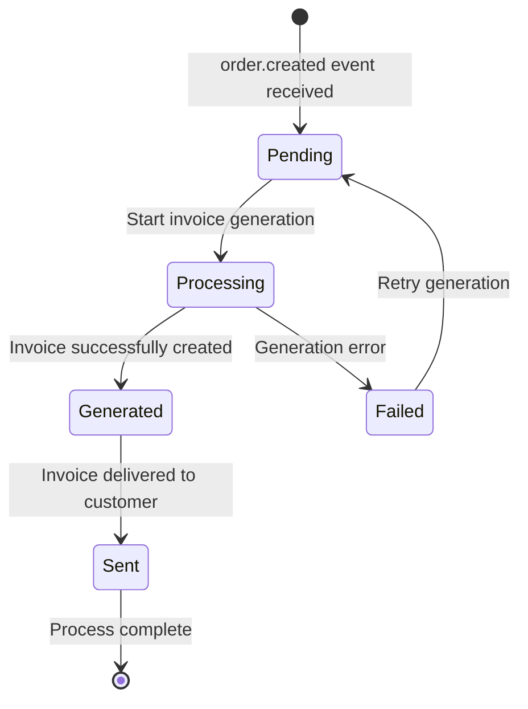

# Invoice Service Feature Documentation

## 📋 Overview

The Invoice Service is responsible for processing order creation events and managing the complete invoice lifecycle, from initial receipt to final generation and storage.

## 🎯 Business Requirements

### Core Functionality
- **Event Processing**: Receive `order.created` events from Order Service
- **Invoice Generation**: Create invoices based on order data
- **Status Management**: Track invoice status through lifecycle
- **Data Persistence**: Store invoice data in dedicated PostgreSQL database

### Invoice Lifecycle

## 🏗️ Architecture Design

> **📋 Note**: For detailed architecture diagrams and data flows, see [Project Structure Documentation](../../architecture/PROJECT_STRUCTURE.md#complete-end-to-end-flow).

### Database Design

> **📋 Note**: For complete database schemas and SQL definitions, see [Technical Specification](./TECHNICAL_SPECIFICATION.md#database-schema).

## 📊 Technical Specifications

### Event Processing
- **Source**: `order-events` exchange
- **Routing Key**: `order.created`
- **Queue**: `invoice-queue`
- **Consumer Type**: Durable, auto-ack disabled

### Invoice Status Flow
1. **Pending** - Event received, processing not started
2. **Processing** - Invoice generation in progress
3. **Generated** - Invoice successfully created
4. **Failed** - Generation failed (with retry logic)
5. **Sent** - Invoice delivered to customer

## 🔄 Event Flow

> **📋 Note**: For detailed event flow diagrams and processing steps, see [Automatic Invoice Creation Guide](./01.CREATE_INVOICE.md#event-processing).

## 🛠️ Implementation Status

✅ **Completed**: All phases implemented and tested
- Service structure and configuration
- Database setup with separate PostgreSQL instance
- Real-time RabbitMQ event consumer
- Complete invoice business logic
- RESTful API endpoints with health checks
- Comprehensive testing suite

> **📋 Note**: For implementation details, see [Automatic Invoice Creation Guide](./01.CREATE_INVOICE.md).

## 📈 Performance Considerations

### Throughput
- **Target**: 1000 invoices/minute
- **Concurrency**: Multiple consumer instances
- **Batch Processing**: Process multiple events together

### Scalability
- **Horizontal**: Multiple service instances
- **Database**: Connection pooling, read replicas
- **Message Broker**: Queue partitioning

### Monitoring
- **Metrics**: Processing time, success rate, queue depth
- **Logging**: Structured logs with correlation IDs
- **Alerts**: Failed invoices, processing delays

## 🔒 Security & Compliance

### Data Protection
- **Encryption**: Sensitive data encrypted at rest
- **Access Control**: Database user with minimal permissions
- **Audit Trail**: All invoice changes logged

### Compliance
- **Data Retention**: Configurable retention policies
- **GDPR**: Personal data handling procedures
- **Financial**: Invoice numbering compliance

## 🚀 Deployment Strategy

> **📋 Note**: For complete deployment configuration and environment setup, see [Technical Specification](./TECHNICAL_SPECIFICATION.md#deployment) and [Testing Guide](../../../test/README.md).

## 📋 Success Criteria

✅ **All criteria met** - Service is production-ready with comprehensive testing and monitoring.

## 📚 Documentation Deliverables

1. **API Documentation** - OpenAPI/Swagger specs
2. **Database Schema** - ERD and migration scripts
3. **Event Schemas** - JSON schema definitions
4. **Deployment Guide** - Step-by-step setup
5. **Monitoring Guide** - Metrics and alerting
6. **Troubleshooting** - Common issues and solutions

### Implementation Guides

- **[01. Automatic Invoice Creation](./01.CREATE_INVOICE.md)** - Complete implementation guide for event-driven invoice creation with RabbitMQ integration

---

*This document will be updated as the implementation progresses.*
